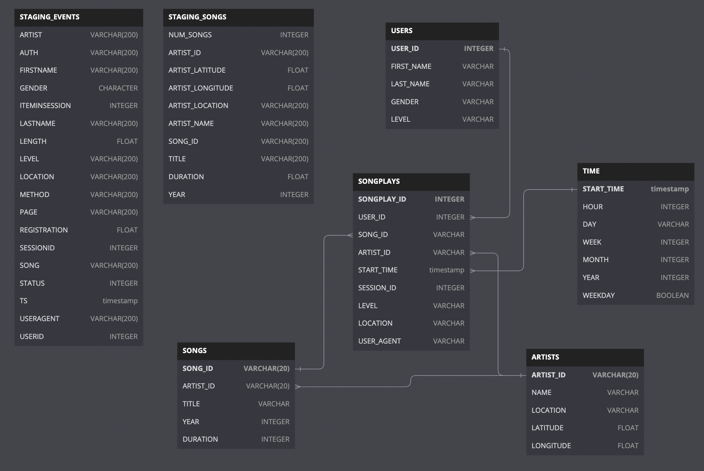

# DatawareHouse Modelling

A music streaming startup, Sparkify, has grown their user base and song database and want to move their processes and data onto the cloud. Their data resides in S3, in a directory of JSON logs on user activity on the app, as well as a directory with JSON metadata on the songs in their app.

As their data engineer, you are tasked with building an ETL pipeline that extracts their data from S3, stages them in Redshift, and transforms data into a set of dimensional tables for their analytics team to continue finding insights into what songs their users are listening to. You'll be able to test your database and ETL pipeline by running queries given to you by the analytics team from Sparkify and compare your results with their expected results.

## Description

In this project, we'll apply what we've learned on data warehouses and AWS to build an ETL pipeline for a database hosted on Redshift. To complete the project, we will need to load data from S3 to staging tables on Redshift and execute SQL statements that create the analytics tables from these staging tables.

## Project Datasets

We'll be working with two datasets that reside in S3. Here are the S3 links for each:

Song data: `s3://udacity-dend/song_data`
Log data: `s3://udacity-dend/log_data`
Log data json path: `s3://udacity-dend/log_json_path.json`

### Song Dataset

The first dataset is a subset of real data from the Million Song Dataset. Each file is in JSON format and contains metadata about a song and the artist of that song. The files are partitioned by the first three letters of each song's track ID. For example, here are file paths to two files in this dataset.

``` sh
song_data/A/B/C/TRABCEI128F424C983.json
song_data/A/A/B/TRAABJL12903CDCF1A.json
```

And below is an example of what a single song file, TRAABJL12903CDCF1A.json, looks like.

```sh
{"num_songs": 1, "artist_id": "ARJIE2Y1187B994AB7", "artist_latitude": null, "artist_longitude": null, "artist_location": "", "artist_name": "Line Renaud", "song_id": "SOUPIRU12A6D4FA1E1", "title": "Der Kleine Dompfaff", "duration": 152.92036, "year": 0}
```

### Log Dataset

The second dataset consists of log files in JSON format generated by this event simulator based on the songs in the dataset above. These simulate app activity logs from an imaginary music streaming app based on configuration settings.

The log files in the dataset you'll be working with are partitioned by year and month. For example, here are file paths to two files in this dataset.

```sh
log_data/2018/11/2018-11-12-events.json
log_data/2018/11/2018-11-13-events.json
```

And below is an example of what the data in a log file, 2018-11-12-events.json, looks like.


## Prerequisites

- AWS Redshift and S3 Basics Knowledge
- AWS Credentials
- Python3

## Database Design

### Create Table Schemas

- Design schemas for your fact and dimension tables
- Write a SQL CREATE statement for each of these tables in sql_queries.py
- Complete the logic in create_tables.py to connect to the database and create these tables
- Write SQL DROP statements to drop tables in the beginning of create_tables.py if the tables already exist. This way, you can run create_tables.py whenever you want to reset your database and test your ETL pipeline.
- Launch a redshift cluster and create an IAM role that has read access to S3.
- Add redshift database and IAM role info to dwh.cfg.
- Test by running create_tables.py and checking the table schemas in your redshift database. You can use Query Editor in the AWS Redshift console for this.

### Build ETL Pipeline

- Implement the logic in redshift.py to create and destory redshift cluster on demand
- Implement the logic in etl.py to load data from S3 to staging tables on Redshift.
- Implement the logic in etl.py to load data from staging tables to analytics tables on Redshift.
- Test by running etl.py after running create_tables.py and running the analytic queries on your Redshift database to compare your results with the expected results.
- Delete your redshift cluster when finished.

## Schema Defintion



## Structure

- `dwh.cfg` - All the configuration required to do processing on data warehouse
- `dwh.py` - It is an orchestartor script which will create redshift cluster and required resources and then create tables using `create_tables.py` and then call `etl.py` to perform etl.
- `redshift.py` - It is used for creating/destroying redshift cluster and related resources on AWS. Run this script as soon as your work is over to avoid any unnecessary charges for unused AWS Resources.
  - Create a cluster : `python3 redshift.py create`
    - This script prints `DWH_ENDPOINT` and `IAM_ROLE` after creating resources.
  - Delete a cluster : `python3 redshift.py delete`
- `create_tables.py` - It creates all the tables required for solving this problem
- `etl.py` - It ingests data from postgres to redshift cluster

## How to Run

- Step 1 : Update key and secret in dwh.cfg
- Step 2 : Run `redshift.py` with `create` as argument
`python3 redshift.py create`
It will populate host and role arn for you in dwh.cfg
- Step 3 : Run `create_tables.py` script
It will create all the staging tables and dimension tables
- Step 4 : Run `etl.py` script
It will load all the required data from staging tables to dimensional tables and do data integrity checks
- Step 5 : Run some queries mentioned in `etl.ipynb` notebook to verify data
- Step 6 : When your work is over run again `redshift.py` with `destroy` as argument
It will clean all the AWS resources created by you for this project

## Outputs

- Loading staging tables finishes in ~4 minutes
- Total Staging Rows added into staging_songs were 14896 and staging_events were 8056.
- Users table has 97 rows
- Artists table has 10025 rows
- Songs table has 14896 rows
- Time table has 8023 rows
- Songplays table has 6820 rows

## References

- Specification Guide : <https://review.udacity.com/#!/rubrics/2501/view>
- The SERIAL command in Postgres is not supported in Redshift. The equivalent in redshift is IDENTITY(0,1), which you can read more on in the Redshift Create Table Docs.
- REMINDER: Do not include your AWS access keys in your code when sharing this project!
- Helped
- <https://stackoverflow.com/questions/36918036/in-amazon-redshift-how-can-i-bulk-insert-rows-only-if-they-dont-already-exist>
- Why drop statement with cascade ?
- <https://stackoverflow.com/questions/32875895/redshift-select-distinct-returns-repeated-values>
- <https://heap.io/blog/redshift-pitfalls-avoid>
- Poor docs - <https://docs.aws.amazon.com/redshift/latest/dg/merge-specify-a-column-list.html>
- Discard Duplicates - <https://stackoverflow.com/questions/50644317/redshift-upsert-where-staging-has-duplicate-items>
- Discard Duplicates - <https://stackoverflow.com/questions/15170701/amazon-redshift-keys-are-not-enforced-how-to-prevent-duplicate-data>
- <https://stackoverflow.com/questions/32875895/redshift-select-distinct-returns-repeated-values>
- <https://stackoverflow.com/questions/656012/copy-rows-from-one-table-to-another-ignoring-duplicates>
- Although DISTINCT helped but not completely
 ```
user_id first_name last_name gender level
15 Lily Koch F paid
15 Lily Koch F free
```
- <https://knowledge.udacity.com/questions/39503>, <https://knowledge.udacity.com/questions/444676>
- Ran into exact same problem <https://knowledge.udacity.com/questions/820971>
- <https://stackoverflow.com/questions/54951196/dont-understand-the-why-configparser-cant-find-the-config-file>
