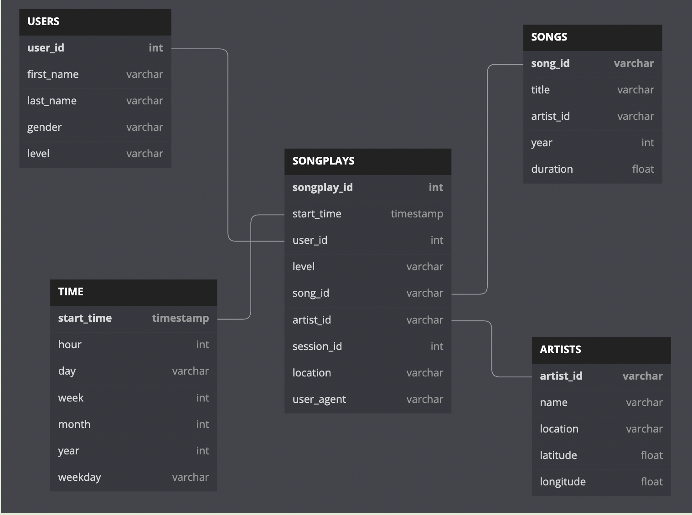

# Postgres-Data-Modelling
A startup called Sparkify wants to analyze the data they've been collecting on songs and user activity on their new music streaming app. The analytics team is particularly interested in understanding what songs users are listening to. Currently, they don't have an easy way to query their data, which resides in a directory of JSON logs on user activity on the app, as well as a directory with JSON metadata on the songs in their app.

They'd like a data engineer to create a Postgres database with tables designed to optimize queries on song play analysis, and bring you on the project. Your role is to create a database schema and ETL pipeline for this analysis. You'll be able to test your database and ETL pipeline by running queries given to you by the analytics team from Sparkify and compare your results with their expected results.

## Prerequisites
- Python3
- Python Modules like configparser, pandas, psycopg2
- Update `postgres.cfg` to include configuration for postgres host, username and password

## Table Schema
#### Schema for Song Play Analysis
Using the song and log datasets, you'll need to create a star schema optimized for queries on song play analysis. This includes the following tables.

- Fact Table
  - songplays - records in log data associated with song plays i.e. records with page NextSong
    - songplay_id, start_time, user_id, level, song_id, artist_id, session_id, location, user_agent

- Dimension Tables
  - users - users in the app
    - user_id, first_name, last_name, gender, level
  - songs - songs in music database
    - song_id, title, artist_id, year, duration
  - artists - artists in music database
    - artist_id, name, location, latitude, longitude
  - time - timestamps of records in songplays broken down into specific units
    - start_time, hour, day, week, month, year, weekday




## Description
#### create_tables.py
The script, create_tables.py successfully connects to the Sparkify database, drops any tables if they exist, and creates the tables.

#### sql_queries.py
CREATE/INSERT/DROP statements in sql_queries.py specify all columns for each of the five tables with the right data types and conditions.

#### etl.py
The script, `etl.py` connects to the Sparkify database, extracts and processes the log_data and song_data, and loads data into the five tables using INSERT SQL Operation.

#### bulketl.py
Temporary tables are created with COPY operations in `sql_queries.py` since there are duplicate data. First all the data with duplicates pushed to these temporary tables and then using these temporary tables we are extracting and loading back data into required tables.

The script, `bulketl.py` connects to the Sparkify database, extracts and processes the log_data and song_data, and loads data into the five tables using COPY SQL Operation.

## Run Scripts
#### Run `create_tables.py`
```
  $ python3 create_tables.py
```
#### Insert Dummy Data `insert_dummy_data.py`
```
  $ python3 insert_dummy_data.py
```
#### Run ETL Script `etl.py`
```
  $ python3 etl.py
```
#### Run ETL Script with Copy Command `bulketl.py`
```
  $ python3 bulketl.py
```

## Output
- Songs Table contains 71 rows
- Artists Table contains 69 rows
- Time Table contains 6813 rows
- Users Table contains 96 rows
- SongPlays Table contains 1 row

## References
- Udacity Rubric Guide <https://review.udacity.com/#!/rubrics/4792/view>
- Helpful Links
  - https://stackoverflow.com/questions/47541579/how-to-have-postgres-ignore-inserts-with-a-duplicate-key-but-keep-going
  - Used for DB Schema Screenshot : https://dbdiagram.io/d