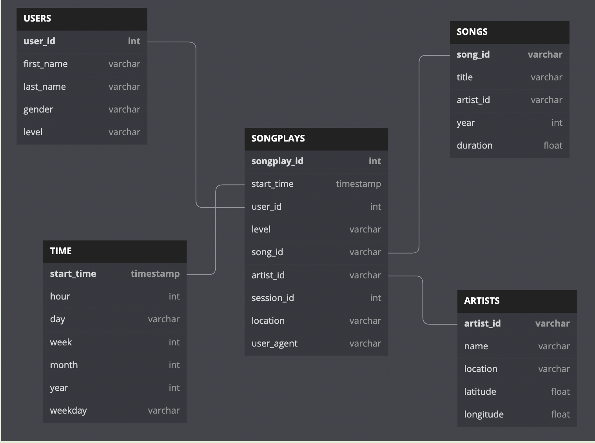

# Postgres-Data-Modelling

A startup called Sparkify wants to analyze the data they've been collecting on songs and user activity on their new music streaming app. The analytics team is particularly interested in understanding what songs users are listening to. Currently, they don't have an easy way to query their data, which resides in a directory of JSON logs on user activity on the app, as well as a directory with JSON metadata on the songs in their app.

They'd like a data engineer to create a Postgres database with tables designed to optimize queries on song play analysis, and bring you on the project. Your role is to create a database schema and ETL pipeline for this analysis. You'll be able to test your database and ETL pipeline by running queries given to you by the analytics team from Sparkify and compare your results with their expected results.

## Dataset Description

### Song Dataset

The first dataset is a subset of real data from the Million Song Dataset. Each file is in JSON format and contains metadata about a song and the artist of that song. The files are partitioned by the first three letters of each song's track ID. For example, here are file paths to two files in this dataset.

`song_data/A/B/C/TRABCEI128F424C983.json`
`song_data/A/A/B/TRAABJL12903CDCF1A.json`

And below is an example of what a single song file, TRAABJL12903CDCF1A.json, looks like.

``` sh
{"num_songs": 1, "artist_id": "ARJIE2Y1187B994AB7", "artist_latitude": null, "artist_longitude": null, "artist_location": "", "artist_name": "Line Renaud", "song_id": "SOUPIRU12A6D4FA1E1", "title": "Der Kleine Dompfaff", "duration": 152.92036, "year": 0}
```

### Log Dataset

The second dataset consists of log files in JSON format generated by this event simulator based on the songs in the dataset above. These simulate activity logs from a music streaming app based on specified configurations.

The log files in the dataset you'll be working with are partitioned by year and month. For example, here are filepaths to two files in this dataset.

`log_data/2018/11/2018-11-12-events.json`
`log_data/2018/11/2018-11-13-events.json`
And below is an example of what the data in a log file, 2018-11-12-events.json, looks like.


## Prerequisites

- PostgreSQL
- Python3
- Python Modules like configparser, pandas, psycopg2
- Update `postgres.cfg` to include configuration for postgres host, username and password

## Table Schema

### Schema for Song Play Analysis

Using the song and log datasets, you'll need to create a star schema optimized for queries on song play analysis. This includes the following tables.

- Fact Table
  - songplays - records in log data associated with song plays i.e. records with page NextSong
    - songplay_id, start_time, user_id, level, song_id, artist_id, session_id, location, user_agent

- Dimension Tables
  - users - users in the app
    - user_id, first_name, last_name, gender, level
  - songs - songs in music database
    - song_id, title, artist_id, year, duration
  - artists - artists in music database
    - artist_id, name, location, latitude, longitude
  - time - timestamps of records in songplays broken down into specific units
    - start_time, hour, day, week, month, year, weekday



## Description

### create_tables.py

The script, create_tables.py successfully connects to the Sparkify database, drops any tables if they exist, and creates the tables.

### sql_queries.py

CREATE/INSERT/DROP statements in sql_queries.py specify all columns for each of the five tables with the right data types and conditions.

### etl.py

The script, `etl.py` connects to the Sparkify database, extracts and processes the log_data and song_data, and loads data into the five tables using INSERT SQL Operation.

### bulketl.py

Temporary tables are created with COPY operations in `sql_queries.py` since there are duplicate data. First all the data with duplicates pushed to these temporary tables and then using these temporary tables we are extracting and loading back data into required tables.

The script, `bulketl.py` connects to the Sparkify database, extracts and processes the log_data and song_data, and loads data into the five tables using COPY SQL Operation.

## Run Scripts

### Run `create_tables.py`

``` sh
  python3 create_tables.py
```

### Insert Dummy Data `insert_dummy_data.py`

``` sh
  python3 insert_dummy_data.py
```

### Run ETL Script `etl.py`

``` sh
  python3 etl.py
```

### Run ETL Script with Copy Command `bulketl.py`

``` sh
  python3 bulketl.py
```

## Output

- Songs Table contains 71 rows
- Artists Table contains 69 rows
- Time Table contains 6813 rows
- Users Table contains 96 rows
- SongPlays Table contains 1 row

## References

- Udacity Rubric Guide <https://review.udacity.com/#!/rubrics/4792/view>
- Helpful Links
  - <https://stackoverflow.com/questions/47541579/how-to-have-postgres-ignore-inserts-with-a-duplicate-key-but-keep-going>
  - Used for DB Schema Screenshot : <https://dbdiagram.io/d>
  - What is a Database Schema - What are your database diagram needs?
    <https://www.lucidchart.com/pages/database-diagram/database-schema>
  - Instance and schema in DBMS
    <https://beginnersbook.com/2015/04/instance-and-schema-in-dbms/>
  - Database Normalization (Explained in Simple English)
    <https://www.essentialsql.com/get-ready-to-learn-sql-database-normalization-explained-in-simple-english/>
  - Foreign Keys in PostgreSQL <https://www.w3resource.com/PostgreSQL/foreign-key-constraint.php>
  - Why should I use FOREIGN KEYs in database? <https://softwareengineering.stackexchange.com/questions/375704/why-should-i-use-foreign-keys-in-database>


## Review Guidelines

### Table Creation

#### The script, create_tables.py, runs in the terminal without errors. The script successfully connects to the Sparkify database, drops any tables if they exist, and creates the tables.

✅The script, create_tables.py, ran without any errors in the terminal
✅Successfully connected to the Sparkify database.
✅Created all the required five tables
✅Dropped the existing tables when it is ran again

CREATE statements in sql_queries.py specify all columns for each of the five tables with the right data types and conditions.

You can implement NOT NULL constraint on the foreign keys in the CREATE statements. However, please be careful with this implementation when you implement the INSERT functions (see rubric "ETL script properly processes transformations in Python") since the dataset contains some null values.

You should run the tests under the Sanity Tests section at the end of the test.ipynb notebook to check your work for obvious errors.

#### PRIMARY KEYs for all tables

✅ songplays: songplay_id
✅ users: user_id
✅ songs: song_id
✅ artists: artist_id
✅time: start_time
Learn more about primary keys:: http://www.postgresqltutorial.com/postgresql-primary-key/
NOT NULLs
✅NOT NULLs are specified where appropriate.

### ETL

#### The script, etl.py, runs in the terminal without errors. The script connects to the Sparkify database, extracts and processes the log_data and song_data, and loads data into the five tables.

Since this is a subset of the much larger dataset, the solution dataset will only have 1 row with values for value containing ID for both songid and artistid in the fact table. Those are the only 2 values that the query in the sql_queries.py will return that are not-NONE. The rest of the rows will have NONE values for those two variables.

It’s okay if there are some null values for song titles and artist names in the songplays table. There is only 1 actual row that will have a songid and an artistid.

You should run the tests under the Sanity Tests section at the end of the test.ipynb notebook to check your work for obvious errors.

✅The script, etl.py, ran in the terminal without errors.
✅The script connects to the Sparkify database, extracted and processed the log_data and song_data, and loaded data into the five tables.

#### INSERT statements are correctly written for each table, and handle existing records where appropriate. songs and artists tables are used to retrieve the correct information for the songplays INSERT.

You should run the tests under the Sanity Tests section at the end of the test.ipynb notebook to check your work for obvious errors.

Nice job updating the level column for users table for the existing records. Users might change from 'free' to 'paid' and vice versa.
For the rest of the tables, artists, songs, time, ON CONFLICT DO NOTHING is fine.
Check this link to know more about the INSERT operation: <https://www.postgresql.org/docs/9.5/sql-insert.html>

### Code Quality

#### Create a README file with the following information:

a summary of the project
how to run the Python scripts
an explanation of the files in the repository
DOCSTRING statements have been added in each function in etl.py file to describe what each function does.

✅ README
Good job with the well-structured and detailed README. A nice README is a great way to showcase your project to potential employers.

Include an ER Diagram to show how the different tables are connected.
You can make use of online tools like <https://www.lucidchart.com/>
Here are some good references:

A curated list of awesome READMEs
<https://github.com/matiassingers/awesome-readme>
How to write a good README for your GitHub project?
<https://bulldogjob.com/news/449-how-to-write-a-good-readme-for-your-github-project>
A Beginners Guide to writing a Kickass README
<https://medium.com/@meakaakka/a-beginners-guide-to-writing-a-kickass-readme-7ac01da88ab3>
✅ Docstrings.
Nice job adding docstrings. The docstrings are essential in describing what a function does. It's not just going to help you understand and maintain your code. It will also make you a better job candidate.

See more details and examples from here: <https://www.pythonforbeginners.com/basics/python-docstrings>

#### Scripts have an intuitive, easy-to-follow structure with code separated into logical functions. Naming for variables and functions follows the PEP8 style guidelines.

The code mostly follows the PEP8 style guide
The SQL statements are well-formatted.
Here's an excellent guide on writing beautiful Python code with PEP8: <https://realpython.com/python-pep8/>
